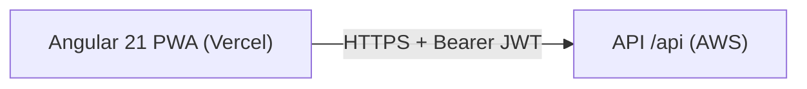

# Arquitectura — Front-end (Active Recall)

Documento técnico del **cliente web**. El backend (Node + Express) es otro
repositorio.

- [1. Visión general](#1-visión-general)
- [2. Feature-based](#2-feature-based)
- [3. Estado con signals](#3-estado-con-signals)
- [4. Auth y HTTP](#4-auth-y-http)
- [5. Rutas](#5-rutas)
- [6. Sistema de diseño](#6-sistema-de-diseño)
- [7. PWA](#7-pwa)
- [8. Decisiones](#8-decisiones)

---

## 1. Visión general



SPA zoneless. Cada feature habla con el servidor solo desde `data/*api.ts`.
Los stores exponen signals; las páginas no conocen URLs ni el sobre `{ data, msg }`.

---

## 2. Feature-based

```
src/app/
├── core/          # auth, interceptor, tema, PWA
├── shared/ui/     # heatmap
├── features/      # un dominio = una carpeta
│   ├── auth/
│   ├── home/          # dashboard + cards de materia
│   ├── subjects/
│   ├── topics/        # listado, por materia, ficha GET :id
│   ├── cards/
│   └── review/
└── layout/
```

`data/` = modelo + cliente HTTP + store. `pages/` = rutas.

---

## 3. Estado con signals

No hay NgRx. Cada store (`providedIn: 'root'`) tiene `signal()` de listas,
`loading` / `saving` y métodos que devuelven `Observable` para que la página
muestre errores del `msg` del API.

Al conectar la API no hubo que reescribir las páginas: ya leían `store.subjects()`,
etc.

---

## 4. Auth y HTTP

- `AuthService` guarda el JWT (y lo reenvía el `authInterceptor`).
- `authGuard` / `guestGuard` cubren el shell y `/login`.
- Un 401 (o usuario deshabilitado) limpia la sesión y manda a login.
- `environment.apiUrl` es la base **con** `/api`. En local apunta a
  `localhost:8080`; en producción debe ser el host de AWS, no `'/api'`.

---

## 5. Rutas

Lazy `loadComponent` bajo `MainLayout` (salvo login):

| Ruta                    | Página |
| ----------------------- | ------ |
| `/login`                | Auth |
| `/`                     | Inicio (stats + materias) |
| `/subjects`             | Materias |
| `/subjects/:id/topics`  | Temas de una materia |
| `/topics`               | Todos los temas |
| `/topics/:id`           | Ficha: título, descripción, preguntas |
| `/cards`                | Todas las preguntas |
| `/review`               | Sesión de repaso |

El título de materia o de tema es un enlace (mismo patrón que “clic en la
fila”). En Preguntas, los dropdowns de materia/tema **solo** salen al crear
desde esa vista global.

---

## 6. Sistema de diseño

- Tokens en `styles.scss` (`:root` / `.app-dark`).
- Preset PrimeNG índigo `#4F46E5`; oscuro en slate, nunca negro puro.
- Inter 18 px / 1.6 en cuerpo.
- `ThemeService` + `localStorage` + clase `.app-dark` en `<html>`.
- Pills del dashboard: naranja = due hoy; azul = preguntas **en proceso**
  (tema con menos de 7 recalls `completed`).

---

## 7. PWA

Service worker solo en `ng build` de producción. `ngsw-config.json` cachea
estáticos y trata `/api/**` con estrategia freshness. `PwaUpdateService` pide
recargar si hay versión nueva.

En Vercel el SW funciona porque se sirve el output `browser/` por HTTPS.

---

## 8. Decisiones

| Decisión                 | Por qué                            | Trade-off |
| ------------------------ | ---------------------------------- | --------- |
| Features por dominio     | Límites claros                     | Más carpetas |
| Signals, no NgRx         | Tamaño de la app                   | Menos devtools |
| Zoneless                 | Menos magia, mejor perfilado       | Hay que marcar CD a mano a veces |
| JWT en el cliente        | API stateless                      | Hay que cuidar XSS; no hay cookies HttpOnly aún |
| `apiUrl` de compile-time | Simple, sin runtime config         | Hay que rebuild al cambiar de host AWS |

El mapa de olvido y el conteo “en proceso” se calculan **en el backend**
(`GetDashboardStats`). El front solo pinta `dueToday`, `topicCount`,
`retentionRate` y `subjects[].inProgress`.
