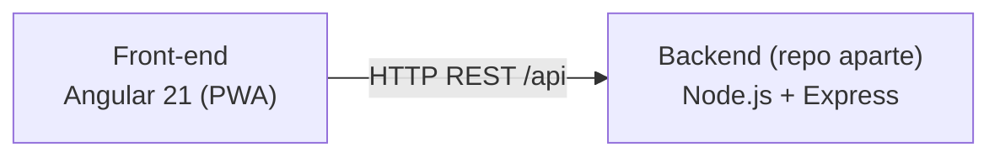
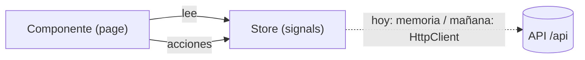

# Arquitectura — Front-end (Active Recall)

Documento técnico del **cliente web**. Describe cómo está construido y por qué.
El backend (API Node.js) vive en un repositorio aparte y expone la API que consume
esta app.

- [1. Visión general](#1-visión-general)
- [2. Arquitectura feature-based](#2-arquitectura-feature-based)
- [3. Estado con signals](#3-estado-con-signals)
- [4. Enrutamiento y lazy loading](#4-enrutamiento-y-lazy-loading)
- [5. Sistema de diseño](#5-sistema-de-diseño)
- [6. PWA](#6-pwa)
- [7. Modelos de dominio](#7-modelos-de-dominio)
- [8. Decisiones y trade-offs](#8-decisiones-y-trade-offs)
- [9. Roadmap técnico](#9-roadmap-técnico)

---

## 1. Visión general



SPA/PWA en Angular 21, con reactividad basada en **signals** y funcionamiento
**zoneless** (sin `zone.js`). La comunicación con el servidor se abstrae en la capa
`data/` de cada feature, de modo que cambiar de origen de datos (hoy in-memory,
mañana la API) no afecta a los componentes.

---

## 2. Arquitectura feature-based

La estructura se organiza por **dominio de negocio** (screaming architecture), no por
tipo de archivo. Cada feature es autocontenida.

```
src/app/
├── core/                 # Singletons transversales (se cargan una vez)
│   ├── services/         #   ej. pwa-update.service.ts
│   └── theme/            #   theme.service.ts, app-preset.ts
├── shared/               # Reutilizable, sin estado propio
│   └── ui/               #   componentes de presentación (ej. study-heatmap)
├── features/             # ← El corazón
│   ├── home/             #   Dashboard
│   ├── subjects/
│   │   ├── data/         #     modelos + store (signals)
│   │   └── pages/        #     componentes de ruta ("inteligentes")
│   ├── topics/
│   ├── cards/
│   └── review/
└── layout/               # Shell (sidebar, navegación)
```

Ventajas: alta cohesión, límites claros y escalabilidad (añadir features no complica
las existentes).

---

## 3. Estado con signals

Se usa **Angular Signals** con servicios *store* por feature, en lugar de NgRx.

- Para el tamaño de la app, NgRx sería sobre-ingeniería.
- `signal()` + `computed()` ofrecen reactividad fina con código simple.
- La app es **zoneless**: mejor rendimiento y menos "magia".

Ejemplo (`subjects/data/subjects.store.ts`): expone `subjects` (readonly signal) y
`count` (computed). Hoy es *in-memory*; al conectar la API se cambia el interior por
llamadas HTTP **sin tocar los componentes** (misma superficie pública).



---

## 4. Enrutamiento y lazy loading

`app.routes.ts` define un shell (`layout/main-layout`) con rutas hijas cargadas con
`loadComponent` (lazy). Cada feature genera su propio *chunk*, reduciendo el bundle
inicial.

---

## 5. Sistema de diseño

Centrado en la legibilidad para sesiones de estudio largas.

- **Tokens CSS** en `styles.scss` (`:root` y `.app-dark`): fondos, superficies,
  jerarquía de texto, radios y **colores de feedback de repaso**
  (`--feedback-again/hard/good/easy`).
- **Preset PrimeNG** (`core/theme/app-preset.ts`): primario **índigo `#4F46E5`**,
  superficies grises frías (claro) y *slate* azulado (oscuro, nunca negro puro).
- **Tipografía Inter**, base 16px, cuerpo 18px con interlineado 1.6.
- **Modo claro/oscuro** (`ThemeService`) con persistencia en `localStorage` y respeto
  a la preferencia del sistema; togglea la clase `.app-dark` en `<html>`.

---

## 6. PWA

Instalable y con caché offline vía `@angular/service-worker`:

- `ngsw-config.json`: cachea la app (JS/CSS), assets y un `dataGroups` para `/api/**`
  (estrategia *freshness*).
- `manifest.webmanifest`: identidad e íconos.
- `PwaUpdateService`: avisa cuando hay una versión nueva.
- El service worker se activa **solo en producción** (no en `ng serve`).

---

## 7. Modelos de dominio

Alineados con las entidades del backend, lo que hace el mapeo directo:

| Modelo      | Campos                                                     |
| ----------- | --------------------------------------------------------- |
| `Subject`   | `id`, `title`, `description`, `createdAt`, `updatedAt`     |
| `Topic`     | `id`, `title`, `description`, `subjectId`, `createdAt`, `updatedAt` |
| `Flashcard` | `id`, `question`, `topicId`, `createdAt`, `updatedAt`     |

El backend expone `camelCase`, y el front consume esa misma forma sin traducción
adicional.

---

## 8. Decisiones y trade-offs

| Decisión                    | Por qué                                        | Trade-off aceptado                           |
| --------------------------- | ---------------------------------------------- | -------------------------------------------- |
| Arquitectura feature-based  | Cohesión y escalabilidad por dominio           | Más carpetas desde el inicio                 |
| Signals en vez de NgRx      | Simplicidad para el tamaño actual              | Menos devtools que NgRx                       |
| Angular zoneless            | Rendimiento y menos "magia"                    | Ecosistema aún adoptándolo                   |
| Store in-memory (temporal)  | Avanzar en UI sin backend                      | Se reinicia al recargar (hasta conectar API) |
| Capa `data/` por feature    | Aislar el origen de datos de la UI             | Una indirección extra                        |
| PrimeNG                     | Componentes ricos listos para usar             | Peso del bundle mayor                        |

---

## 9. Roadmap técnico

1. **Conectar a la API**: cambiar los stores de in-memory a `HttpClient` (ya provisto
   en `app.config.ts`).
2. **Features Temas y Flashcards**: CRUD completo.
3. **Módulo de repaso**: motor de repetición espaciada con los botones de feedback ya
   diseñados (Otra vez / Difícil / Bien / Fácil).
4. **Dashboard con datos reales**: métricas y heatmap alimentados por la API.
5. **Testing**: pruebas de stores y componentes con Vitest.
